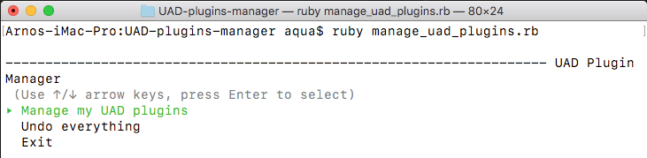
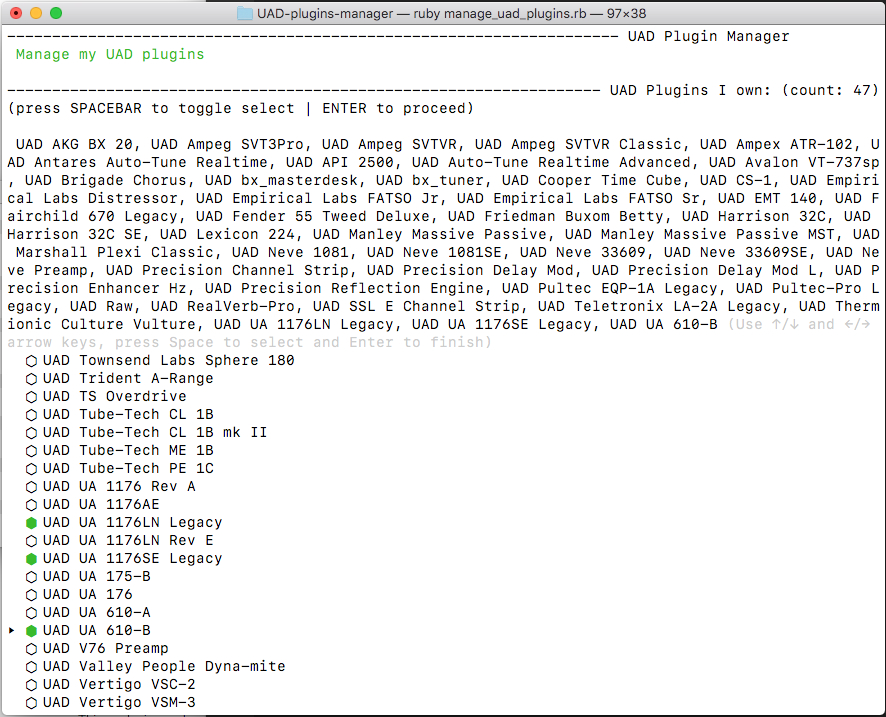
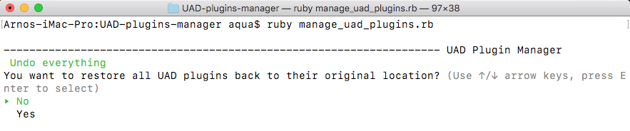

# UAD-Plugins-Manager
#### Manage Universal Audio plugins on a Mac / OSX

### The pain point
If like me, you're beyond tired of Universal Audio installing all of their plugins on every update, and than having a hard time finding the ones you actually own when using a DAW, this might be the solution to your pain. I've been meaning to write this utility for ages. It took a pandemic to finally make it happen.

**UAD Plugins Manager** requires basic knowledge of the Mac command line, because it runs in the Terminal, but it's intuitive and easy to use.

### How does it work?
**UAD Plugins Manager** simply moves UAD plugins in and out of the system folder; keeping the plugins you own in the system folder ('/Library/Audio/Plug-Ins/[Components/ and vst/]'), and moving the ones you don't own into a 'managed_plugins/[Components/ and vst/]' sub folder. The plugins are moved, never copied or deleted, so nothing will be lost or compromised.

### Installation

Open a terminal window, and clone repo. At terminal prompt, type:

`cd ~`

`git clone https://github.com/arnox747/UAD-plugins-manager.git`

`cd UAD-plugins-manager`

*Finally, install the ruby gem tty-prompt:*

`gem install tty-prompt`

*if the above fails, you may need to run it as sudo:*
`sudo gem install tty-prompt`

### Running UAD Plugins Manager
At the terminal prompt, type `cd ~/UAD-plugins-manager` to go to the UAD Plugin Manager folder, then type:

`ruby manage_uad_plugins.rb` to start the app.

The main menu should appear, and hopefully requires no explanation:

If you chose the `‣ Manage my UAD plugins` option, you'll be presented with a list of all of your UAD plugins, and an easy way to select the ones that you own (hit the SPACE BAR to toggle selection). You can use arrow up/down to move by one in either direction, or arrow left/right to go up and down by a page.

The plugins that you select here will be kept in the system folder. The ones that you don't select will be moved to the managed_plugins folder (component, vst, and vst mono). If you don't select any plugins, they will all be moved to the managed_plugins folder, and that's probably not what you want. That being said, even if you do make a mistake, you can just `Undo everything`.

### Support
I have developed this for my own use, and I'm sharing it here with hopes that it will help others. If you run into any issues, you can try to contact me on https://alphagolive.com, or even better, just post on https://stackoverflow.com